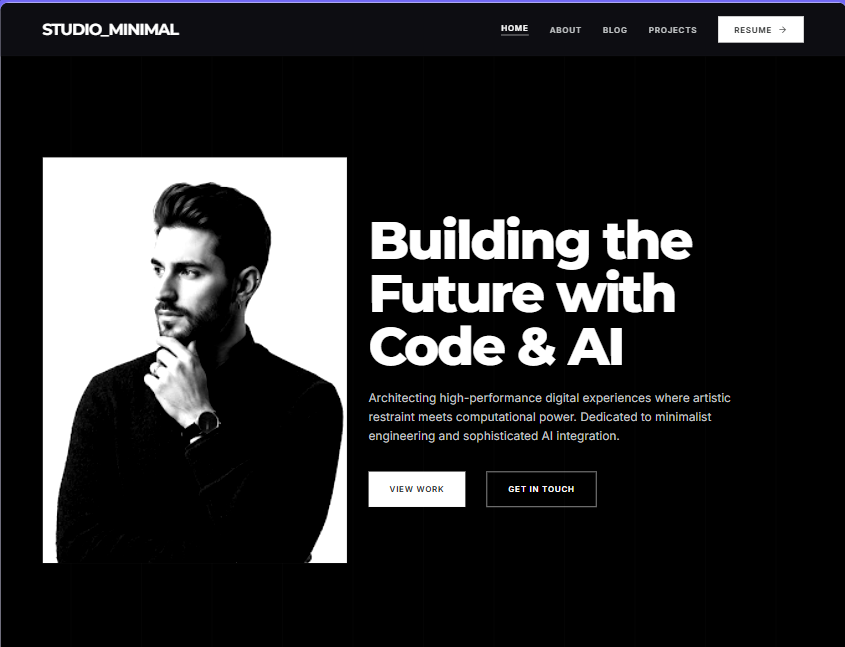
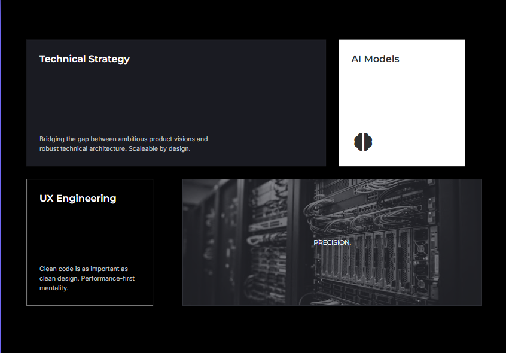
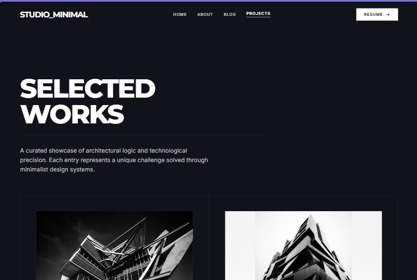
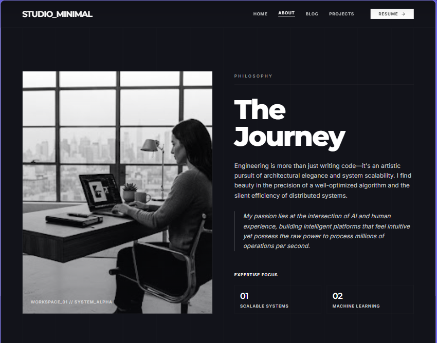
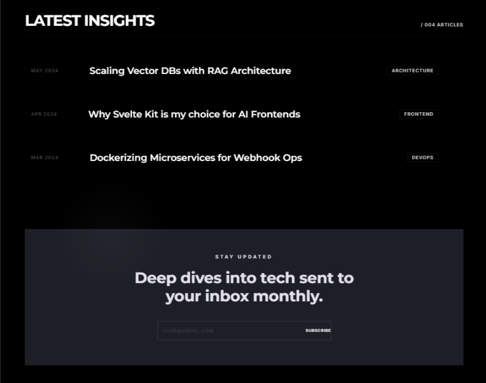

<div align="center">

# Byte_Foundry__

### Full Stack Developer & AI Integration Portfolio

**A high-performance, monochrome-themed portfolio showcasing modern web architecture,
intelligent AI automation, and minimalist design systems.**

[](https://byte-foundry.vercel.app)
[](https://github.com/soloStack-Dev)
[](https://www.linkedin.com/in/faleel-h-b772a1416/)

---



</div>

---

## Overview

Byte_Foundry__ is a developer portfolio built with **React 19**, **TypeScript**, and **Vite**, featuring scroll-driven animations via **GSAP**, state management with **Zustand**, and a serverless contact system powered by **Resend**. The entire UI follows a strict monochrome design language — no color, no compromise.

---

## Tech Stack

<div align="center">

| Category | Technologies |
|----------|-------------|
| **Frontend** |    |
| **Styling** |   |
| **Animation** |  |
| **State** |  |
| **Data Fetching** |  |
| **Validation** |  |
| **Email** |  |
| **Routing** |  |
| **Backend** |  |

</div>

---

## Pages

<div align="center">

| Page | Description | Preview |
|------|-------------|---------|
| **Home** | Hero section, expertise grid, selected works, CTA with email subscription |  |
| **Projects** | Project showcase with hover animations and live preview overlays |  |
| **About** | Developer bio, skills visualization, workflow breakdown |  |
| **Blog** | AI-generated historical news content with category filtering |  |

</div>

---

## Features

```
  SCROLL ANIMATIONS          MONOCHROME DESIGN           SERVERLESS API
  GSAP-powered hero          Strict black & white        Vercel serverless
  stagger reveals            color palette               functions for
  fade-in sections           with zero color             email delivery
  parallax effects           compromise

  MOBILE RESPONSIVE          CONTACT MODAL               EMAIL SUBSCRIPTION
  Full mobile sidebar        Popup form with             Resend-powered
  navigation with            Title, Subject,             subscribe feature
  solid backdrop             Message fields              with real-time
                                                         status feedback

  TYPE-SAFE                  STATE MANAGEMENT            PERFORMANCE
  Full TypeScript 6          Zustand global              Vite 8 bundler
  with strict               store for                   with React
  type checking              UI state                   Compiler
```

---

## Project Structure

```
personal-enquire/
├── api/
│   └── send-email.ts          # Vercel serverless — Resend integration
├── public/
│   ├── favicon.svg            # Custom lightning bolt icon
│   ├── ProjectThumbnailImage/ # Project preview thumbnails
│   └── skillsImage/           # Tech stack skill icons
├── src/
│   ├── components/
│   │   ├── Navbar.tsx         # Fixed nav + mobile hamburger menu
│   │   ├── Footer.tsx         # Social links + copyright
│   │   └── ContactModal.tsx   # Email popup modal
│   ├── pages/
│   │   ├── HomePage.tsx       # Hero + expertise + works + CTA
│   │   ├── ProjectPage.tsx    # Project showcase grid
│   │   ├── AboutPage.tsx      # Bio + skills + workflow
│   │   └── BlogPage.tsx       # Historical blog content
│   ├── hooks/
│   │   └── useScrollAnimation.ts  # GSAP scroll triggers
│   ├── store/
│   │   └── useStore.ts        # Zustand global state
│   ├── App.tsx                # Router + layout
│   ├── main.tsx               # Entry point
│   └── index.css              # Global styles + CSS variables
├── UIDesign/                  # UI design screenshots
├── ProjectThumbnailImage/     # Project preview images
├── skillsImage/               # Skill icon images
├── vercel.json                # Vercel deployment config
├── vite.config.ts             # Vite configuration
└── package.json
```

---

## Getting Started

### Prerequisites

- **Node.js** >= 18
- **npm** or **bun**

### Installation

```bash
# Clone the repository
git clone https://github.com/soloStack-Dev/PersonalPortfolio.git

# Navigate to project
cd PersonalPortfolio/personal-enquire

# Install dependencies
npm install

# Start development server
npm run dev
```

The app will be available at `http://localhost:5173`.

### Environment Variables

Create a `.env` file in the root:

```env
RESEND_EMAIL_API_KEY=your_resend_api_key_here
```

> The contact modal and email subscription feature requires a [Resend](https://resend.com) API key.  
> For Vercel deployment, add this key in your project's **Environment Variables** dashboard.

---

## Available Scripts

| Command | Description |
|---------|-------------|
| `npm run dev` | Start Vite dev server with HMR |
| `npm run build` | TypeScript check + production build |
| `npm run preview` | Preview production build locally |
| `npm run lint` | Run ESLint |

---

## Design Philosophy

> **Monochrome. Minimal. Meaningful.**

Every element serves a purpose. The black-and-white palette forces focus on
**typography**, **spacing**, and **motion** — the three pillars of this design system.
No decorative color. No visual noise. Just structure and intent.

---

## Live Projects

| Project | Link |
|---------|------|
| Campfire Website | [camp-client-mu.vercel.app](https://camp-client-mu.vercel.app/) |
| Historical Blog Agent | [historical-news-blog-agent.vercel.app](https://historical-news-blog-agent.vercel.app/politics) |
| Musical Platform | [music-client-brown.vercel.app](https://music-client-brown.vercel.app/) |

---

## Contact

**Faleel H**

[](https://github.com/soloStack-Dev)
[](https://www.linkedin.com/in/faleel-h-b772a1416/)
[](mailto:faleelmr4@gmail.com)

---

<div align="center">

**Built with precision. Deployed on Vercel.**

</div>
